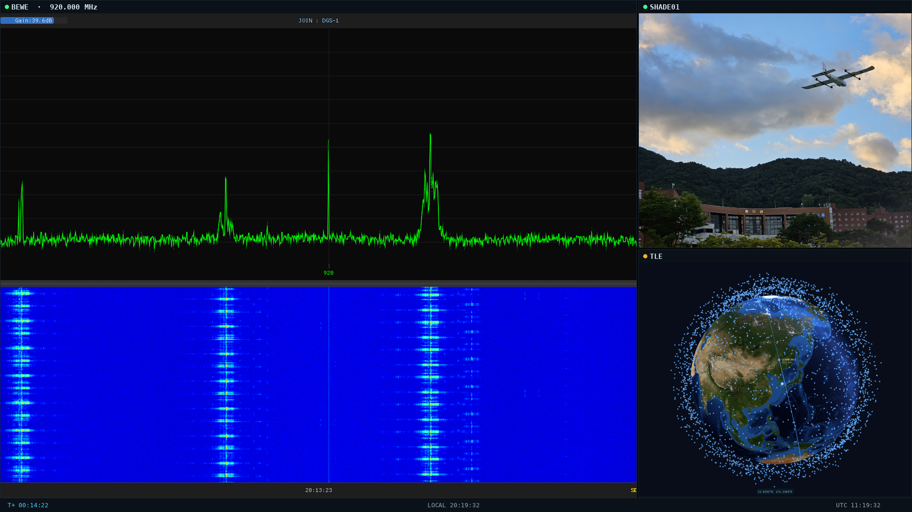

# BEWEX



현장에 흩어진 카메라 세 대(휴대폰 2대 + PC 화면 1개)를 관제 화면 하나로 모으는 시스템입니다.
브라우저만 있으면 붙습니다 — 앱 설치도 로그인도 없습니다.

```
 [폰 1] ─┐
 [폰 2] ─┼──▶ [ 중앙 서버 ] ──▶ [ 관제 화면 ]
 [PC 창] ─┘    (라즈베리파이)     CAM 1 / CAM 2 / BEWE
```

| | |
|---|---|
| 소스 | 휴대폰 카메라 2대 + PC 창(또는 전체 화면) 1개 |
| 전송 | WebRTC P2P — 막히면 서버 릴레이로 자동 전환 |
| 서버 | 라즈베리파이 상시 구동, Node 순정(네이티브 모듈 없음) |
| 코드 | 약 4,000줄, 런타임 의존성 4개 (express · ws · qrcode · selfsigned) |

## 왜 만들었나

현장 요원이 폰으로 촬영하는 화면과 PC의 지상국 소프트웨어(QGC 등)를
관제석에서 동시에 봐야 하는데, 기존엔 화면 공유 툴을 여러 개 따로 띄우고
있었습니다. 연결이 끊기면 누가 어디서 끊겼는지 알 수 없었고, 네트워크가
막히면 그냥 화면이 멈췄습니다.

**슬롯 고정(QR로 CAM1/CAM2 구분), 연결 상태 표시(WebRTC/RELAY 구분,
해상도·비트레이트·RTT 실시간), 자동 우회(P2P 실패 시 10초 내 릴레이 전환)**
세 가지를 서버·클라이언트 양쪽에 직접 구현했습니다.

---

## 관제 화면은 셋을 한눈에 봅니다

세 칸은 고정입니다 — **CAM 1 / CAM 2 / BEWE**.
어느 칸이 비어 있는지, 어느 칸이 어떤 방식으로 들어오고 있는지 항상 보입니다.

```
┌─────────────────────────┬───────────┐
│                         │  CAM 2    │
│        CAM 1            │  WebRTC   │
│        WebRTC           ├───────────┤
│   1920×1080 30fps       │  BEWE     │
│   2.4 Mbps  RTT 12ms    │  RELAY    │
└─────────────────────────┴───────────┘
   T+ 00:14:22        LOCAL 15:20:41   UTC 06:20:41
```

- **해상도·fps·비트레이트·RTT**가 칸마다 1초 주기로 갱신됩니다.
  숫자를 보면 "화면이 멈춘 건지 네트워크가 죽은 건지"를 바로 압니다.
- 레이아웃 두 가지 — 메인 1 + 사이드 2, 또는 3등분. `l` 키로 전환합니다.
  사이드를 클릭하면 그 칸이 메인으로 올라옵니다.
- 패널 더블클릭 → 전체화면. 칸마다 음소거 토글.
- 하단에 **미션 클록**(T+). 눌러서 시작·일시정지, 우클릭으로 리셋.

---

## 네트워크가 막히면 알아서 우회합니다

기본은 WebRTC P2P입니다. 하지만 방화벽이나 대칭형 NAT 뒤에서는 P2P가 안 붙습니다.
그래서 **10초 안에 연결이 안 되면 스스로 서버 릴레이로 갈아탑니다.**

```
방송 시작 ─▶ WebRTC 협상 ─▶ 연결됨 ────────▶  WebRTC (원래 화질)
                  │
                  └─ 10초 경과 ─▶ RELAY (JPEG 640px · 10fps)
                                        │
                                        └─ P2P 복귀 성공 시 자동 원복
```

릴레이는 화질을 포기하는 대신 **끊기지 않는 쪽**을 택합니다.
관제 화면에는 그 칸이 `RELAY`로 표시되므로, 지금 보고 있는 게
열화된 영상이라는 사실이 감춰지지 않습니다.

**밀리면 버립니다.** 실시간성이 화질보다 중요하므로,
송신 큐가 1MB를 넘으면 그 프레임을 건너뛰고, 서버도 수신이 밀린 뷰어(2MB 초과)에게는
프레임을 보내지 않습니다. 느린 뷰어 하나가 전체를 끌어내리지 않습니다.

---

## 이렇게 씁니다

```
서버       →  라즈베리파이에서 상시 구동 (systemd, 손 안 댐)
현장       →  QR 찍고 방송 시작
송출 PC    →  창 하나 골라서 세 번째 칸
관제       →  앱 켜면 자동 접속, 세 칸 동시 감시
막히면     →  릴레이로 자동 전환, 뚫리면 자동 복귀
```

---

## 저장소 구성

| 폴더·파일 | 내용 |
|---|---|
| `server/` | 중앙 서버 — HTTPS 정적 서빙, WebSocket 시그널링, 슬롯 배정, 프레임 릴레이 |
| `public/` | 세 개의 웹 UI — 폰 송출(`mobile`), 송출 허브(`ingest`), 관제(`monitor`) |
| `ingest-main.js` · `monitor-main.js` | Electron 껍데기 — 창 캡처 권한, 인증서 예외, 재접속 |
| `test/` | 시그널링 통합 테스트 + 브라우저 E2E 3종 |
| `scripts/` | 라파 배포, 로컬 서버 실행, 데스크톱 아이콘 설치 |
| `deploy/` | systemd 서비스 템플릿 |

관제 UI는 **순수 웹 페이지**입니다 — Electron 앱 없이 브라우저에서 `/monitor`를 열어도
똑같이 동작합니다. Electron은 "창 캡처"와 "자체 서명 인증서 자동 수락"에만 필요합니다.

---

# 이하 운용 상세

## 구성 요소

| 구성 | 실행 | 역할 |
|------|------|------|
| 중앙 서버 | `node server/standalone.js` (라파, systemd) | HTTPS+WebSocket 상시 구동. 슬롯 배정/시그널링/프레임 릴레이, 폰(`/mobile`)·모니터(`/monitor`)·허브(`/ingest`) 페이지 서빙 |
| BEWEX Hub | `ingest-main.js` | PC에서 실행. 로컬 UI를 띄우고 실행 중인 창을 골라 슬롯3(BEWE, 프로토콜상 `kind:'app'`)으로 캡처 송출 |
| BEWEX Monitor | `monitor-main.js` | central에 자동 접속하는 관제 모니터. CAM 1 / CAM 2 / BEWE 고정 3슬롯, 미션 클록, 텔레메트리 |

BEWEX Hub / Monitor는 UI를 로컬 소스(`public/*.html`)에서 직접 로드하고
central에는 WebSocket 시그널링·프레임만 붙습니다. 서버가 꺼져 있어도 창은 뜨고
연결만 재시도합니다.

## 설치 (클라이언트 PC)

폰은 브라우저만 있으면 되고, PC 두 대(송출용·관제용)에만 앱을 깔면 됩니다.

```bash
git clone <repo> && cd BEWEX
npm install                  # 의존성 설치 (최초 1회)
```

### 데스크톱 아이콘 생성 (Linux)

바탕화면 아이콘이 이 저장소의 소스를 직접 실행합니다(빌드 불필요, `git pull`이면 최신).

```bash
npm run install:desktop      # BEWEX Hub + BEWEX Monitor 아이콘 둘 다 생성
npm run install:ingest       # BEWEX Hub 아이콘만
npm run install:monitor      # BEWEX Monitor 아이콘만
```

아이콘 없이 바로 실행:

```bash
npm run start:ingest         # BEWEX Hub (창 캡처 송출)
npm run start:monitor        # BEWEX Monitor (3분할 관제)
```

> 아이콘이 "실행 안 됨"으로 나오면 우클릭 → 실행 허용(Allow Launching).

## 라즈베리파이 서버 배포

### 사전 조건

1. Tailscale 연결: 배포 PC와 라파가 같은 tailnet 안에 있어야 합니다.
   라파의 Tailscale IP는 `100.123.59.3`로 가정합니다(다르면 `deploy:central` 인자로 지정).
2. SSH 공개키 등록: `ssh-copy-id raspb2@100.123.59.3`로 미리 등록하세요(스크립트는 비대화식 SSH 사용).
3. 원격 node 설치: 라파에 node 필요(없으면 스크립트가 안내 후 중단).
   `sudo apt install -y nodejs npm` 또는 nodesource 배포판.

### 배포 실행

```bash
npm run deploy:central                     # 기본 raspb2@100.123.59.3 로 배포
npm run deploy:central -- pi@100.123.59.3  # HOST 지정
npm run deploy:central -- --no-service     # systemd 등록 없이 파일만 전송(수동 실행)
```

배포 스크립트(`scripts/deploy-central.sh`)가 하는 일:

1. SSH 연결 확인(실패 시 공개키 등록 안내).
2. 원격 node 존재 확인(없으면 설치 안내).
3. `server/`(`server.js`·`cert.js`·`standalone.js`), `public/`, `package.json`을
   rsync로 `~/bewe-server/`에 전송(`node_modules`·`release` 제외).
4. 원격에서 `npm install --omit=dev`(express/qrcode/selfsigned/ws — 전부 pure JS라 ARM OK).
5. `--no-service`가 아니면 `deploy/bewe-server.service` 템플릿을 원격 사용자/경로로 치환해
   `/etc/systemd/system/bewe-server.service`에 설치하고 `daemon-reload && enable --now`(sudo 필요).
6. 방화벽 안내: `8443`을 `tailscale0` 인터페이스에만 허용하도록 권장(강제 아님).
7. `curl -sk https://100.123.59.3:8443/api/info`로 검증.

### 로컬에서 서버만 띄워 검증

라파 없이 개발 PC에서 서버 동작만 확인할 때:

```bash
npm run server:local          # 기본 포트 8443
npm run server:local 8600     # 포트 지정
# 또는 직접:
BEWE_PORT=8600 node server/standalone.js
curl -sk https://127.0.0.1:8600/api/info    # {port, ips} 반환 확인
```

## 사용법

### 1) 휴대폰 2대 (CAM 1 / CAM 2)

Tailscale로 tailnet에 연결한 뒤 브라우저에서:

- 슬롯1(CAM 1): `https://<central>/mobile?slot=1`
- 슬롯2(CAM 2): `https://<central>/mobile?slot=2`

가장 쉬운 방법은 BEWEX Hub 화면의 QR 코드 2개를 스캔하는 것입니다(주소를 몰라도 됨).

- "연결이 비공개로 설정되어 있지 않습니다" 경고가 나오면 고급 → 이동(계속).
  (자체 서명 인증서라서 나오는 정상 경고)
- [방송 시작] 버튼을 누르고 카메라 권한을 허용합니다.

### 2) PC 화면 (BEWE)

송출 PC에서 BEWEX Hub 앱을 실행합니다.

```bash
npm run start:ingest
```

- 앱이 로컬 UI를 띄우고 WS만 central에 붙습니다.
  (서버가 꺼져 있으면 창은 뜬 채로 연결만 재시도, 켜지면 자동 접속)
- BEWE 캡처 카드에서 [창 선택] → 송출할 창을 클릭하면 그 창만 슬롯3(BEWE)으로 송출됩니다.
  목록 맨 위의 "전체 화면"을 고르면 화면 전체가 나갑니다.
- Wayland/PipeWire 세션에서는 창 클릭 시 OS 화면 선택 창(xdg-desktop-portal)이 떠서
  실제 창을 고릅니다. X11은 앱 목록에서 고른 창을 바로 캡처합니다.

### 3) 관제 (BEWEX Monitor)

관제 PC에서 BEWEX Monitor 앱을 실행합니다.

```bash
npm run start:monitor       # npm start 와 동일
```

- 앱이 시작 시 central에 자동 접속합니다(꺼져 있으면 재시도 루프).
- 수동 재접속은 시작 화면에서 주소를 바꿔 접속(기본 central 주소가 프리필됨).
- 또는 브라우저에서 `https://<central>/monitor` 접속.
- 레이아웃: 메인 1 + 사이드 2(사이드 클릭 시 메인 승격) ↔ 3등분 — `l` 키 또는 버튼으로 전환.
- 패널 더블클릭 → 전체화면, 패널별 음소거 토글, 하단 미션 클록 `T+`.

## 시그널링 프로토콜 (v2)

WebSocket `/ws`, JSON 텍스트 메시지.

**등록**

| 방향 | 메시지 |
|---|---|
| 방송자 → 서버 | `{type:'register', role:'broadcaster', name?, slot?, kind?}` — `kind ∈ camera\|screen\|app`, `slot ∈ 1\|2\|3` |
| 뷰어 → 서버 | `{type:'register', role:'viewer', observer?}` — `observer:true` 는 상태판 전용(프레임 릴레이·뷰어수 제외) |
| 서버 → 방송자 | `{type:'registered', id, slot}` |
| 서버 → 뷰어 | `{type:'registered', id, broadcasters:[{id,name,slot,kind,fallback}]}` |

**슬롯 배정 규칙**

- 명시적 `slot` → last-wins. 기존 방송자는 `4002 slot-taken`으로 종료.
- 미지정 `camera` → 1→2 중 빈 곳. 둘 다 차면 `4003 slots-full`로 거부.
- 미지정 `app`/`screen` → 슬롯 3 (last-wins).

**중계·이벤트**

| 종류 | 메시지 |
|---|---|
| 1:1 중계 | `watch` / `offer` / `answer` / `ice` / `stop` — `target`을 `from`으로 바꿔 상대에게 전달 |
| 방송자 변동 | `broadcaster-joined` / `broadcaster-left` → 모든 뷰어(observer 포함) |
| 뷰어 수 | `viewer-count` → 모든 클라이언트 (observer 미포함 집계) |
| 뷰어 이탈 | `viewer-left` → 모든 클라이언트 (방송자의 피어 정리용) |
| 릴레이 | `fallback-start` / `fallback-stop` → 모든 뷰어 · `frame` → observer 제외 모든 뷰어 |

죽은 연결은 15초 주기 ping/pong으로 정리합니다.

## 전송 방식

| 모드 | 설명 |
|------|------|
| WebRTC (기본) | P2P 저지연. STUN `stun.l.google.com:19302`. 창 캡처는 `contentHint='detail'` |
| RELAY (보조) | P2P가 10초 안에 안 붙으면 자동 전환. canvas → JPEG 최대 640px · 품질 0.55 · 10fps를 WS로 릴레이 |

백프레셔: 송신측은 `bufferedAmount > 1MB`면 프레임을 건너뛰고,
서버는 `bufferedAmount > 2MB`인 뷰어에게 프레임을 보내지 않습니다.
WS `maxPayload`는 8MB입니다.

## CENTRAL 주소·포트 변경

기본값은 `100.123.59.3:8443`입니다. 다른 주소를 쓰려면 환경변수로 지정합니다.

| 대상 | 변수 | 기본값 |
|------|------|--------|
| BEWEX Hub / BEWEX Monitor 앱 | `BEWE_CENTRAL` (호스트), `BEWE_PORT` (포트) | `100.123.59.3` / `8443` |
| 서버(standalone) | `BEWE_PORT` (리슨 포트), `BEWE_CERT_DIR` (인증서 경로), `BEWE_PUBLIC_HOST` (공개 주소 고정) | `8443` / `~/.config/bewe-server/cert` / (미설정=자동 감지) |

`BEWE_PUBLIC_HOST`를 지정하면 `/api/info`·QR·접속 주소가 그 주소 하나로 고정됩니다
(예: Tailscale IP `100.123.59.3`). 인증서(SAN)는 모든 로컬 IP를 커버하므로
localhost·LAN 접속에서도 경고 없이 붙습니다. `deploy:central`은 배포 대상 IP를
자동으로 이 값에 넣습니다.

예:

```bash
BEWE_CENTRAL=100.99.0.5 BEWE_PORT=9000 npm run start:monitor
BEWE_PORT=9000 npm run start:server
```

포트가 사용 중이면 서버가 `+19`까지 자동 탐색합니다.
인증서는 새 IP가 생겨 SAN이 커버하지 못하면 유효기간이 남아 있어도 재생성됩니다.

## 개발

```bash
npm install
npm run server:local    # 로컬에서 중앙 서버만 띄워 검증 (BEWE_PORT로 포트 지정)
npm run start:ingest    # BEWEX Hub 실행 (central 접속)
npm run start:monitor   # BEWEX Monitor 실행 (central 자동 접속, npm start와 동일)
```

## 테스트

```bash
npm test                # 시그널링 서버 통합 테스트 (슬롯 배정/중계/relay 검증)
npm run test:e2e        # 브라우저 E2E (모바일→모니터, 보조모드, BEWE 슬롯 릴레이)
```

E2E 테스트는 Chrome이 필요합니다. 경로가 다르면 `CHROME_PATH` 환경변수로 지정하세요
(기본 `/usr/bin/google-chrome`).

## 코드 업데이트 · 아이콘 동작 (Linux)

데스크톱 아이콘은 이 저장소의 소스를 직접 실행하므로 코드 갱신에 재빌드가 필요 없습니다.

```bash
cd BEWEX
git pull                     # 소스 갱신
# 끝. 아이콘을 다시 누르면 최신 코드로 실행됨.
```

- 아이콘의 `Exec`은 `scripts/bewe-run.sh <ingest|monitor>`를 가리키며, 이 런처가
  저장소 루트에서 `electron`으로 소스를 바로 띄웁니다(`Path`로 작업 디렉터리 고정).
- 런처는 nvm이 로드되지 않은 GUI 세션(GNOME 더블클릭)에서도 node를 찾도록 PATH를
  직접 보정하고, `node_modules`가 없거나 `package-lock.json`이 바뀌면 `npm ci`를 자동 실행합니다.
- 저장소를 옮기면 아이콘의 경로가 깨지므로 `npm run install:desktop`을 다시 실행하세요.
- 아이콘이 "실행 안 됨"으로 나오면 우클릭 → 실행 허용(Allow Launching).
  (스크립트가 GNOME 신뢰 플래그를 자동 설정하지만 일부 환경은 수동 허용 필요)

## 파일 구성

```
server/standalone.js          중앙 서버 부트스트랩 (Electron 없이 순수 node — 라파 headless 상시 구동)
server/server.js              HTTPS 정적 서버 + WebSocket 시그널링/슬롯 배정/프레임 릴레이
server/cert.js                자체 서명 인증서 생성/재사용 (IP 변경 시 재생성)
ingest-main.js                BEWEX Hub Electron 메인 (로컬 UI 로드 + 창 캡처 IPC + central 인증서 예외)
ingest-preload.js             BEWEX Hub preload (창 목록/선택 API 브리지)
monitor-main.js               BEWEX Monitor Electron 메인 (central 자동 접속 + 인증서 예외)
monitor-preload.js            BEWEX Monitor preload (connect API 브리지)
monitor-connect.html          모니터 시작/폴백 화면 (central 주소 프리필, 재시도)
public/mobile.*               휴대폰 송출 페이지 (getUserMedia + WebRTC + 보조 모드)
public/ingest.*               허브 UI (QR 2개, BEWE 슬롯 창 캡처, 슬롯 상태판)
public/monitor.*              관제 모니터 페이지 (순수 웹 — 브라우저에서도 동작)
public/style.css              공용 스타일
deploy/bewe-server.service    systemd 서비스 템플릿 (배포 스크립트가 사용자/경로 치환)
scripts/deploy-central.sh     라파 중앙 서버 배포 (rsync + npm install + systemd 등록)
scripts/run-server-local.sh   로컬에서 서버만 띄워 검증
scripts/install-desktop.sh    Linux 바탕화면 아이콘 설치 (아이콘 → bewe-run.sh 연결)
scripts/bewe-run.sh           소스 직접 실행 런처 (git pull 후 재빌드 없이 최신 코드 실행)
test/signaling-test.js        시그널링 통합 테스트
test/e2e-test.js              모바일→모니터 E2E
test/fallback-e2e-test.js     보조 모드(RELAY) E2E
test/app-relay-e2e-test.js    BEWE 슬롯(창 캡처) 릴레이 E2E
```
